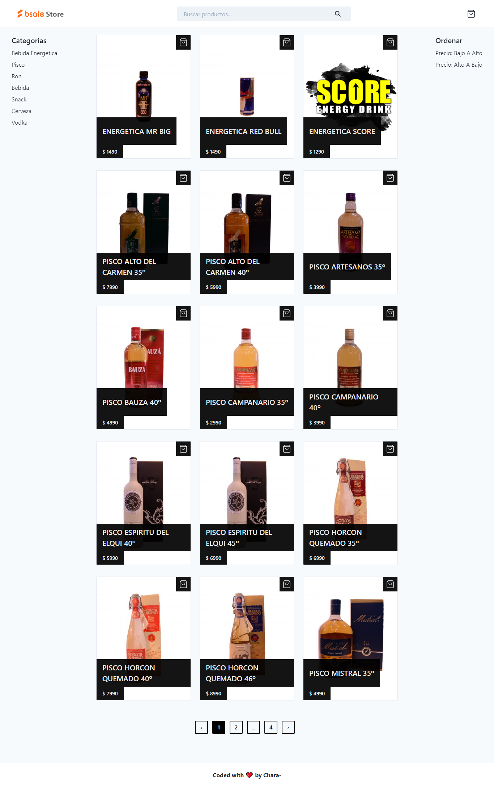
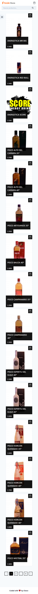

<h1 align="center">BSale Store <small><i>test</i></small></h1>

<div align="center">
  <h2>
    <a href="https://bsale-store.vercel.app/" target="_blank" >
      Demo
    </a>
  </h2>
</div>

<!-- TABLE OF CONTENTS -->

## 🔥 Table of Contents

- [Overview](#overview)
  - [Built With](#built-with)
- [Features](#features)
- [How to use](#how-to-use)
- [Contact](#contact)
- [Acknowledgements](#acknowledgements)

<!-- OVERVIEW -->

## Overview

<details>
  <summary>💻 Desktop version</summary>




</details>

<details>
  <summary>📱 Mobile version</summary>




</details>

### Built With

- [Javascript](https://developer.mozilla.org/es/docs/Web/JavaScript)
- [Nextjs](https://nextjs.org/)
- [React](https://reactjs.org/)
- [Chakra-ui](https://chakra-ui.com/)
- [CSS](https://developer.mozilla.org/es/docs/Web/CSS)
- [SWR](https://swr.vercel.app/)
- [MySQL](https://www.mysql.com/)
- [TypeScript](https://www.typescriptlang.org/)

## Features

This is a [Next.js](https://nextjs.org/) project that started with [`create-next-app`](https://github.com/vercel/next.js/tree/canary/packages/create-next-app), which was created as a challenge post to [BSale](https://www.bsale.com.pe/). The challenge consisted in creating a BSale store (test) that displays products, filtered products and grouped by category to which they belong from a database.

## How To Use

### Step 1. Getting Started

Open [http://localhost:3000](http://localhost:3000) with your browser to see the result.

To clone and run this application, you'll need [Git](https://git-scm.com) and [Node.js](https://nodejs.org/en/download/) (which comes with [npm](http://npmjs.com)) installed on your computer. From your command line:

```bash
# Clone this repository
$ git clone https://github.com/jcarlos0511/bsale-store.git

# Enter the created folder
$ cd bsale-store

# Install dependencies
$ yarn install

# Run the app
$ yarn dev

# Visit http://localhost:3000/
```

### Step 2. Set up a MySQL database

Set up a MySQL server either locally or any cloud provider.

### Step 3. Set up environment variables

Copy the `env.local.example` file in this directory to `.env.local` (which will be ignored by Git):

```bash
cp .env.local.example .env.local
```

Set each variable on `.env.local`:

- `MYSQL_HOST` - Your MySQL host URL.
- `MYSQL_DATABASE` - The name of the MySQL database you want to use.
- `MYSQL_USERNAME` - The name of the MySQL user with access to database.
- `MYSQL_PASSWORD` - The passowrd of the MySQL user.

## Acknowledgements

- [Next.js examples - GitHub](https://github.com/vercel/next.js/tree/canary/examples)
- [React TypeScript Cheatsheets](https://react-typescript-cheatsheet.netlify.app/)
- [MySQLTutorial](https://www.mysqltutorial.org/)
- [Marked - a markdown parser](https://github.com/chjj/marked)

## Contact

- GitHub [@jcarlos0511](https://github.com/jcarlos0511)
- Twitter [@jncarloschara](https://twitter.com/jncarlos0511)
